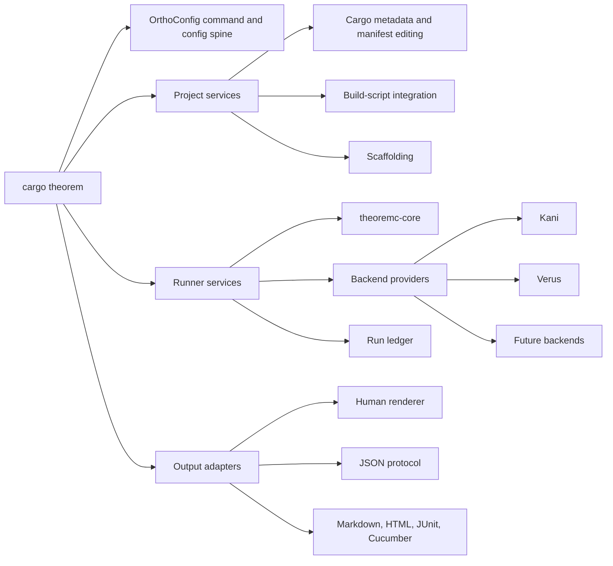

# `cargo theorem` CLI design

Status: proposed. This document defines the target command-line interface and
its implementation boundaries. The implementation sequence lives in
[the roadmap](roadmap.md).

## 1. Decision summary

Theoremc will expose one Cargo-native application entry point:

```console
cargo theorem <command> [options]
```

The distributable package and executable will both be named `cargo-theorem`.
Direct invocation as `cargo-theorem` remains supported for tests and unusual
execution environments, but documentation and diagnostics use `cargo theorem`.

`cargo theorem` subsumes three previously separate areas of planned or existing
functionality:

- the suite execution, reporting, stable identity, and replay work previously
  assigned to the proposed `theoremd` executable;
- project scaffolding and the installation, validation, and execution of
  theoremc's Cargo build-script integration; and
- proof-backend installation, pin verification, toolchain preparation, and
  low-level execution currently provided by `leynos/rust-prover-tools`.

The CLI uses `ortho_config` for configuration discovery and merging, generated
command documentation, recursive subcommand metadata, localization, and compact
agent context. The command surface follows the agent-native principles described
by Trevin Chow and the stricter reusable contract in OrthoConfig's agent-native
CLI design.[^agent-native][^ortho-agent-native]

The CLI is not a second theorem compiler. It is an application shell around
library-owned parsing, generation, execution, reporting, and project-mutation
services.

## 2. Product goals

`cargo theorem` must make the shortest safe path the ordinary path. A user or
agent should be able to initialize a package, create a theorem, verify project
integration, obtain the required prover, run the proof, inspect the result, and
produce CI artefacts without learning a collection of unrelated scripts.

The CLI has these goals:

1. Provide one discoverable entry point to every supported theoremc workflow.
2. Keep normal commands non-interactive and deterministic.
3. Make every data-returning command available as bounded, versioned JSON.
4. Treat project changes as previewable, atomic, and idempotent mutations.
5. Keep backend installation separate from proof execution and never install a
   tool implicitly during `check`, `build`, or `run`.
6. Preserve theoremc's compile-time connectedness instead of replacing it with
   one-shot generation.
7. Record every execution in a canonical run model that feeds human reports,
   CI formats, counterexample replay, and job inspection.
8. Absorb the durable behaviour of `rust-prover-tools` without preserving its
   Python implementation or its command vocabulary as a second public API.
9. Keep backend-specific details behind a stable capability interface while
   still exposing an explicit low-level escape hatch.
10. Generate enough command metadata for an agent to select and invoke commands
    without scraping prose help.

## 3. Non-goals

The first release does not:

- provide a hosted dashboard or remote execution service;
- invent a package manager independent of Cargo, Rustup, or backend release
  archives;
- edit theorem intent or synthesize proof logic from natural language;
- silently repair arbitrary Rust source when safe structural editing is not
  possible;
- translate one backend's proof language into another;
- guarantee that every future verifier can be installed by theoremc; or
- expose backend subprocess output as the stable public result schema.

MCP generation, remote workers, webhook delivery, and automatic theorem
suggestions may build on the same command metadata later, but they do not block
the local CLI.

## 4. Naming, packaging, and minimum Rust versions

### 4.1 Cargo external subcommand

A dedicated workspace package at `crates/cargo-theorem/` owns the
`cargo-theorem` binary. Cargo discovers that executable on `PATH` and exposes it
as `cargo theorem`. The entry point normalizes Cargo's external-subcommand
argument convention before parsing the application arguments.

The dedicated package keeps application-only dependencies out of the
consumer-facing `theoremc` facade. The root package remains a library facade and
build-integration owner rather than accumulating CLI rendering, process control,
Cargo metadata, and report-delivery dependencies. The placeholder
`src/main.rs` is removed when `cargo-theorem` lands so theoremc does not ship an
unrelated `theoremc` executable beside the Cargo subcommand.

### 4.2 Mixed minimum supported Rust version policy

At the time of this design, theoremc declares Rust 1.88 while `ortho_config`
0.9.0 declares Rust 1.89.0. The CLI package therefore declares Rust 1.89.0 and
the library packages retain Rust 1.88 until a separate compatibility decision
raises their minimum supported Rust version (MSRV).

Continuous integration must test these contracts separately:

```console
cargo +1.88 check --workspace --exclude cargo-theorem
cargo +1.89 check -p cargo-theorem
```

A workspace-wide MSRV increase may replace this split later, but adding the CLI
must not silently increase the compiler required by theoremc library consumers.

### 4.3 Retirement of `theoremd`

`theoremd` has not shipped as a compatibility surface. The implementation must
therefore use `cargo theorem` from the outset rather than introducing a binary
that immediately needs deprecation. Existing design and roadmap references to
`theoremd` describe capabilities, not a retained executable name.

## 5. Architectural boundaries

The target architecture separates command contracts from domain side effects.
OrthoConfig models and derives the command/configuration spine. Theoremc owns
proof semantics and execution.



*Figure 1: Application, project, runner, backend, and output boundaries.*

The initial crate responsibilities are:

| Package | Responsibility |
| --- | --- |
| `cargo-theorem` | Cargo entry point, OrthoConfig types, dispatch, human and JSON application rendering, exit-code mapping |
| `theoremc-core` | Theorem loading, validation, identifiers, aliases, backend-neutral intermediate representation, diagnostics |
| `theoremc-build` | Reusable theorem discovery, suite rendering, build-script entry points, Cargo manifest and `build.rs` integration plans |
| `theoremc-runner` | Backend provider interface, command execution abstraction, canonical run records, run ledger, replay orchestration |
| `theoremc-report` | Markdown, HTML, JUnit XML, Cucumber JSON, and canonical JSON report rendering |
| `theoremc-macros` | Compile-time theorem expansion and generated backend harnesses |

*Table 1: Initial package responsibilities and dependency boundaries.*

`theoremc-build`, `theoremc-runner`, and `theoremc-report` may begin as
feature-grouped modules while their interfaces settle. They must nevertheless
respect these dependency directions. The CLI must not become the only place
where reusable project, execution, or report logic exists.

The application depends inward on the libraries. Core libraries do not depend
on `cargo-theorem`, Clap, terminal rendering, or process-global configuration.
Project and artefact filesystem services use `camino`, `cap_std`, and
`cap_std::fs_utf8` rather than ambient `std::fs` operations.

## 6. OrthoConfig command and configuration spine

### 6.1 Required OrthoConfig capabilities

`cargo theorem` treats these OrthoConfig capabilities as hard ship-time
dependencies:

- recursive whole-CLI metadata through `OrthoConfigSubcommandDocs`;
- selected-subcommand configuration merging through
  `SelectedSubcommandMerge`;
- the compact, independently versioned agent-context schema;
- generated and localizable human help; and
- agent-native vocabulary and global-option policy checks.

Profiles, delivery targets, feedback stores, skill-manifest validation, and the
execution-ledger contract are soft dependencies in OrthoConfig's design. Until
the reusable contracts ship, theoremc may carry narrow adapters for those
surfaces. Each adapter must name the OrthoConfig roadmap item it shadows and be
replaced in the next theoremc release after the reusable contract becomes
available. Theoremc must not fork the agent-context or documentation schemas.

### 6.2 Type shape

The command tree is declared once with Clap and OrthoConfig derives. The exact
field list will evolve with implementation, but the structural pattern is:

```rust
#[derive(Debug, Parser)]
#[command(name = "cargo theorem", bin_name = "cargo theorem", version)]
pub struct CommandLine {
    #[command(flatten)]
    pub globals: GlobalArgs,
    #[command(subcommand)]
    pub command: Commands,
}

#[derive(
    Debug,
    Clone,
    Subcommand,
    ortho_config_macros::SelectedSubcommandMerge,
    ortho_config::OrthoConfigSubcommandDocs,
)]
pub enum Commands {
    Init(InitArgs),
    List(ListArgs),
    Get(GetArgs),
    Create(CreateArgs),
    Action(ActionCommand),
    Check(CheckArgs),
    BuildScript(BuildScriptCommand),
    Generate(GenerateArgs),
    Run(RunArgs),
    Replay(ReplayArgs),
    Report(ReportCommand),
    Backend(BackendCommand),
    Jobs(JobsCommand),
    Profile(ProfileCommand),
    Context(ContextArgs),
    Feedback(FeedbackArgs),
}

#[derive(Debug, Clone, Deserialize, Serialize, OrthoConfig)]
#[ortho_config(
    prefix = "THEOREMC",
    discovery(
        app_name = "theoremc",
        config_file_name = "theoremc.toml",
        dotfile_name = ".theoremc.toml",
        project_file_name = "theoremc.toml",
        config_cli_long = "config",
        config_cli_visible = true,
    )
)]
pub struct CargoTheoremConfig {
    // Global and selected-subcommand configuration.
}
```

The CLI uses OrthoConfig's localized parser and generated command metadata. A
hand-maintained second command schema is prohibited.

### 6.3 Discovery and precedence

The canonical project configuration file is `theoremc.toml` at the Cargo
workspace root. An explicit `--config <path>` suppresses discovery. User-level
configuration may provide renderer and installation-cache defaults, but project
proof policy must live in the project file or theorem evidence.

Resolved values follow this precedence, from lowest to highest:

```text
built-in defaults
< discovered configuration files
< selected profile
< THEOREMC_* environment variables
< command-line arguments
```

The selected subcommand receives only its relevant merged configuration.
Configuration for `backend install` must not leak into `run`, and a `run`
profile must not alter project mutation commands unless it declares those
fields explicitly.

Legacy `KANI`, `VERUS_*`, and `INPUT_*` variables from `rust-prover-tools` are
accepted only by the migration adapter and only for the corresponding backend
command. Human mode emits a deprecation diagnostic. JSON mode records the
legacy source in a non-localized `warnings` array without contaminating stdout
with prose.

### 6.4 Workspace and package selection

Commands that inspect or mutate a Cargo project accept these global selectors:

- `--manifest-path <path>` selects a Cargo manifest;
- `--package <package-id>` selects one workspace member;
- `--workspace` selects all eligible members; and
- `--exclude <package-id>` excludes members from workspace selection.

Selection uses the stable `cargo metadata` JSON protocol through the
`cargo_metadata` crate. Ambiguous package names fail with an error that lists
the valid package identifiers. Mutation commands require one unambiguous target
unless their contract explicitly supports workspace-wide changes.

## 7. Public command surface

The first stable command tree is:

```text
cargo theorem init
cargo theorem list
cargo theorem get <theorem-id>
cargo theorem create <theorem-name>
cargo theorem action list
cargo theorem action get <action-name>
cargo theorem action create <action-name>
cargo theorem check
cargo theorem build-script install
cargo theorem build-script check
cargo theorem build-script run
cargo theorem build-script delete
cargo theorem generate
cargo theorem run
cargo theorem replay <run-id> [--id <theorem-id>]
cargo theorem report create <run-id>
cargo theorem backend list
cargo theorem backend get <backend>
cargo theorem backend install <backend>
cargo theorem backend check <backend>
cargo theorem backend sync
cargo theorem backend update <backend>
cargo theorem backend delete <backend>
cargo theorem backend run <backend>
cargo theorem jobs list
cargo theorem jobs get <job-id>
cargo theorem jobs cancel <job-id>
cargo theorem jobs prune
cargo theorem profile list
cargo theorem profile get <profile>
cargo theorem profile save <profile>
cargo theorem profile delete <profile>
cargo theorem context --json
cargo theorem feedback <text>
```

`init`, `check`, `generate`, `run`, `replay`, `install`, `sync`, and `cancel`
are domain verbs rather than CRUD synonyms. They are intentional vocabulary
exceptions and must appear as such in agent context. The primary theorem
resource uses the canonical top-level `list`, `get`, and `create` verbs so the
CLI does not stutter as `cargo theorem theorem list`.

### 7.1 Command capability matrix

| Command | Effect | JSON | Bounded | Mutation guard |
| --- | --- | --- | --- | --- |
| `init` | Add theoremc project integration | Yes | Not applicable | `--dry-run`; `--force` only for conflicts |
| `list` | List theorem metadata | Yes | `--limit`, `--cursor` | Read-only |
| `get` | Read one theorem and its resolved metadata | Yes | One resource | Read-only |
| `create` | Scaffold a theorem document | Yes | One resource | `--dry-run`; refuses to overwrite without `--force` |
| `action *` | Inspect or scaffold action bindings | Yes | Lists are paginated | Mutations support `--dry-run` |
| `check` | Validate sources, aliases, integration, and configured backend availability | Yes | Summary plus artefact paths | Read-only by default; `--compile` is effectful; never installs |
| `build-script *` | Manage or execute build integration | Yes | One package per mutation | Mutations support `--dry-run` and atomic writes |
| `generate` | Render suite, harness, or metadata output | Yes | Selected theorems only | Writes only through `--deliver` |
| `run` | Execute selected theorem evidence | Yes | Filtered selection and bounded summaries | Records a run; never installs |
| `replay` | Reproduce a stored counterexample | Yes | One run/theorem at a time | Creates a child run record |
| `report create` | Render a stored canonical run | Yes | One run, selected formats | Writes only through `--deliver` |
| `backend *` | Inspect and manage prover tools | Yes | Backend list is paginated | Install/update/delete support `--dry-run` |
| `jobs *` | Inspect durable run state | Yes | `--limit`, `--cursor`; log excerpts bounded | Cancel/prune require explicit targets |
| `profile *` | Manage named configuration overlays | Yes | Profile list is paginated | Save/delete support `--dry-run`; delete needs `--force` |
| `context` | Emit compact command context | Required | Versioned compact schema | Read-only and project-independent |
| `feedback` | Record CLI friction | Yes | One record | Local append; optional delivery is explicit |

*Table 2: Command effects, response bounds, and mutation guards.*

## 8. Global application contracts

### 8.1 Non-interactive operation

Commands do not prompt by default. Missing required values fail immediately and
name the required flags. A future human wizard may be exposed only through an
explicit `--interactive` flag and cannot be the sole route to any operation.

`--no-input` is accepted globally and makes the no-prompt contract explicit.
It is useful in generated examples and CI even though the default already avoids
prompts. Destructive confirmation bypass uses `--force`; synonyms such as
`--yes` and `--skip-confirmations` are not introduced.

### 8.2 Human and machine output

Data-returning commands support `--json`. In JSON mode:

- success writes exactly one JSON document to stdout and nothing to stderr;
- failure writes no stdout and exactly one JSON diagnostic document to stderr;
- `result` is present only for a successful command and contains command data;
- `error` is present only for a failed command and contains its diagnostic;
- `result` and `error` are mutually exclusive and absent from envelopes whose
  status is neither `success` nor `error`;
- progress, subprocess output, and tracing logs are captured rather than
  inherited;
- the result includes paths to full logs and artefacts instead of embedding
  unbounded output; and
- schema identifiers, diagnostic codes, exit classes, backend names, and status
  values are never localized.

`--json --deliver stdout` is invalid. It returns one usage-error JSON diagnostic
on stderr and does not deliver the report or generated source, preserving stdout
for exactly one JSON document. JSON callers must use a file or another
supported delivery target.

Human mode writes primary output to stdout and diagnostics or progress to
stderr. The global renderer options follow OrthoConfig's glossary:

```text
--color auto|always|never
--emoji auto|always|never
--progress auto|always|never
--accessibility auto|on|off
--plain
--no-pager
--width <columns>
--locale <locale>
--quiet
--verbose
```

A report's domain format is separate from the application protocol. For
example, `report create --format junit --json` returns a JSON command result
whose `artefacts` array identifies the JUnit file. It does not place XML beside
JSON on stdout.

### 8.3 JSON envelope

All application JSON documents use a versioned envelope. Command-specific data
lives under `result` for successful commands only. Failure diagnostics live under
`error` for failed commands only; the two fields are mutually exclusive.

```json
{
  "schema_version": "1",
  "kind": "cargo-theorem.run.result",
  "command": ["run"],
  "status": "success",
  "result": {
    "run_id": "01J6Y7ZKQ9Y8W13Q2H4ST8X9N7",
    "summary": {
      "selected": 12,
      "passed": 12,
      "failed": 0,
      "incomplete": 0
    },
    "artefacts": [
      {
        "kind": "canonical_run",
        "path": ".theoremc/runs/01J6Y7ZKQ9Y8W13Q2H4ST8X9N7/run.json"
      }
    ]
  }
}
```

The success example contains command data only in `result`; the failure example
contains its diagnostic only in `error`. An envelope never includes both.

Errors use the same versioning discipline and enumerate known choices when
applicable:

```json
{
  "schema_version": "1",
  "kind": "cargo-theorem.diagnostic",
  "command": ["backend", "get"],
  "status": "error",
  "error": {
    "code": "backend.unknown",
    "class": "usage",
    "message_fallback": "unknown backend 'versu'",
    "arguments": { "backend": "versu" },
    "valid_values": ["kani", "verus"]
  }
}
```

The application envelope and theorem run-record schema version independently.
Changing report fields must not force a command-protocol version bump unless the
application envelope itself changes incompatibly.

### 8.4 Exit-code taxonomy

The stable application exit codes are:

| Code | Class | Meaning |
| --- | --- | --- |
| `0` | `success` | The command completed and all selected evidence matched policy |
| `2` | `usage` | Arguments or a selected value were invalid |
| `3` | `configuration` | Configuration could not be discovered, merged, or validated |
| `4` | `project_state` | Cargo package or theoremc integration state was unsuitable |
| `5` | `backend_unavailable` | A required backend was missing or did not match its pin |
| `6` | `verification_mismatch` | Actual proof status differed from declared evidence policy |
| `7` | `verification_incomplete` | A selected proof was unreachable, undetermined, timed out, or cancelled without an accepted expectation |
| `8` | `external_tool_failure` | Cargo, Rustup, or a backend failed outside a parsed proof result |
| `9` | `delivery_failure` | Execution succeeded but an explicitly requested delivery target failed |
| `10` | `internal` | The CLI violated an invariant or encountered an unclassified failure |

*Table 3: Stable application exit classes and their process exit codes.*

Backend-native exit codes are recorded in run data and diagnostics. The
high-level CLI never leaks them as its own unstable taxonomy. The low-level
`backend run` command offers `--passthrough-exit-code` for migration scripts;
that flag disables the stable application exit-code promise and is marked as an
advanced compatibility option in agent context.

### 8.5 Bounded responses

Every list command defaults to 50 entries, accepts `--limit`, and returns an
opaque `next_cursor` when more data exists. The maximum accepted limit is 500.
Errors caused by an excessive limit state the maximum valid value.

Human summaries include at most ten failing theorem entries before pointing to
the canonical run artefact. JSON summaries contain bounded arrays and explicit
counts. Full backend logs are stored as artefacts and retrieved through a
specific `jobs get` request with an explicit byte limit.

## 9. Project initialization and scaffolding

### 9.1 `init`

`cargo theorem init` calculates and applies one project integration plan. The
plan may:

- create `theoremc.toml` when no project configuration exists;
- create `theorems/` and `.theoremc/` support directories;
- add `.theoremc/` runtime artefacts to `.gitignore`;
- add the theoremc runtime and build dependencies to the selected manifest;
- install the managed build-script call;
- create or connect `src/theorem_actions.rs`; and
- optionally add a small compiling example when `--example` is present.

The default is additive. Existing files are preserved unless theoremc can prove
that a managed fragment can be updated safely. `--dry-run` returns a structured
plan containing create, edit, unchanged, conflict, and manual-action entries.
`--force` authorizes only the specific conflicts named in that plan; it does not
turn arbitrary source rewriting into an accepted operation.

Applying the same plan twice must result in no content changes. All file writes
use a temporary sibling, flush, and atomic rename. Multi-file changes acquire a
workspace-local lock and retain a recovery journal until all renames complete.

### 9.2 Theorem scaffolding

`cargo theorem create <theorem-name>` creates one valid `.theorem` document. The
positional value is the theorem's name (`T`), not its canonical external ID. It
accepts `--about`, `--backend`, `--tag`, `--path`, and `--template`. Without an
explicit path, it derives `theorems/<normalized-name>.theorem`. The canonical
external ID is then `{normalized_path(P)}#<theorem-name>`, where `P` is the
created path; callers use that ID with `get` and stable-ID selectors.

An explicit `--path` is resolved relative to the selected workspace when it is
not absolute. Before any file is written, theoremc canonicalizes the workspace
root and the path (resolving existing symlinks), then verifies that the target
remains within the canonical workspace. The default `theorems/` path receives
the same containment check. External paths are not supported, so there is no
escape hatch from this guard.

The scaffold contains no invented business property. It includes explicit
placeholders represented as schema-valid documentary text and refuses to claim
that a proof exists. `--template example` may create a complete pedagogical
example, but ordinary creation does not generate assertions from the theorem
name.

`action create` can add a theorem-side signature declaration and a deterministic
re-export entry for an existing Rust function. Function-body generation requires
an explicit `--stub` mode and a complete parameter and return signature. The
default does not add `todo!()`, panic stubs, or lint suppressions to consumer
code.

### 9.3 Inspection commands

`list` returns stable theorem IDs, paths, tags, configured backends, and a short
status summary. `get` returns one theorem's parsed document, canonical ID,
aliases, generated harness names, referenced actions, and evidence policy.
Source text is omitted from JSON unless `--include-source` is explicit.

`action list` and `action get` expose canonical names, mangled exports, declared
signatures, source theorems, and binding-probe status. They do not attempt Rust
reflection beyond the compile-time contracts theoremc already owns.

## 10. Build-script integration

### 10.1 Managed call contract

The public build helper is one stable call:

```rust
theoremc::build::emit_suite_from_env_or_exit();
```

The helper owns Cargo environment reading, theorem discovery,
`cargo::rerun-if-changed` output, generated-suite writing, deterministic error
rendering, and process termination appropriate to a build script. A separate
fallible library API supports tests and direct CLI execution.

The injector adds the call once inside `fn main`. It parses `build.rs` with
`syn` to prove that the file is valid Rust and uses source spans to insert the
statement without reformatting unrelated code. Cases it cannot locate or edit
safely become plan conflicts rather than guessed text substitutions.

The selected package manifest receives a compatible theoremc build dependency.
The mutation preserves existing dependency source information where possible.
Workspace dependencies are used when the workspace already centralizes them.

### 10.2 Commands

`build-script install` creates or updates the managed call and manifest entry.
It supports `--dry-run` and is idempotent.

`build-script check` verifies:

- the manifest contains a usable build dependency;
- exactly one managed call is reachable from `fn main`;
- the configured theorem root agrees with discovery;
- generated-suite inclusion exists in the target crate; and
- a normal Cargo build will observe theorem source changes.

`build-script run` calls the same fallible build service directly. By default it
uses a temporary output directory and returns the rendered suite as an artefact.
`--out-dir` is an advanced diagnostic option. This command never impersonates
Cargo by mutating the caller's environment globally.

`build-script delete` removes only theoremc-managed statements and dependencies.
It requires `--force`, supports `--dry-run`, and refuses removal when another
manifest entry or source reference still needs the dependency.

### 10.3 `check` and `generate`

Top-level `check` composes schema validation, alias validation, action-signature
checks, build-script checks, and non-installing backend pin checks. The default
command is read-only. `check --compile` is an explicit effectful command
boundary: Cargo may execute the package's arbitrary `build.rs`, so its plan and
agent context classify it separately from read-only validation. Network access
and backend installation remain out of scope in both modes.

`generate` exposes deterministic internal artefacts for diagnosis and tooling:

```text
cargo theorem generate --kind suite
cargo theorem generate --kind harness --id path/to/file.theorem#TheoremName
cargo theorem generate --kind metadata
```

Generated output goes to stdout only in human/plain mode when it is the sole
payload. Machine callers use `--json` for metadata and `--deliver file:<path>`
for large generated source.

## 11. Theorem selection and execution

### 11.1 Selection

`run`, `generate`, and report-oriented inspection share one selection model:

- exact stable IDs through repeated `--id`;
- path globs through repeated `--path`;
- tags through `--tag` and `--exclude-tag`;
- package and workspace selectors;
- backend through `--backend auto|kani|verus|all`; and
- optional changed-file selection through `--changed-since <git-revision>`.

Selectors combine by intersection across categories and union within a repeated
category. The resolved selection is sorted by stable theorem ID. An empty
selection fails by default and explains the active filters; `--allow-empty`
turns it into a successful no-op for conditional CI jobs.

`--backend auto` runs each theorem's declared evidence backends. It never falls
back from one verifier to another. `--backend all` requests every configured
backend supported by the theorem and reports unsupported combinations
explicitly.

### 11.2 Run lifecycle

`cargo theorem run` performs these stages:

1. Resolve workspace, configuration, profile, and theorem selection.
2. Validate theorem sources and stable IDs.
3. Check required backend installations and pins without changing them.
4. Materialize an immutable execution plan and input digest.
5. Create a run directory and ledger record.
6. Execute backend jobs with bounded parallelism.
7. Parse backend-native results into canonical theorem outcomes.
8. Apply expected-status, witness, vacuity, and incomplete-result policy.
9. Persist the canonical run record before rendering summaries or delivery.
10. Return a stable application status and artefact references.

Runs wait by default. `--no-wait` starts a durable child process, returns the
job ID, and leaves all output in the run directory. `--wait` remains the
canonical positive flag in metadata and may be set explicitly by automation.
`--timeout`, `--jobs`, `--keep-going`, and `--fail-fast` control bounded
execution. `--keep-going` and `--fail-fast` are mutually exclusive.

An optional `--idempotency-key` prevents duplicate active submissions. Reusing
a key with an identical input digest returns the existing job. Reusing it with
different inputs fails and reports both digests. `--force-new` creates a new job
while retaining the relationship to the prior run.

#### Concurrency and task ownership

The workspace lock covers mutation plans, idempotency reservations, and the
append-only run index. A per-run lock covers that run's plan, record, and
artefacts. Lock acquisition has one order—workspace, then run—and code never
acquires them in reverse. Each acquisition has a bounded timeout and reports
the current owner and lock path on timeout; a stale owner is recoverable only
through startup reconciliation, not by silently breaking the lock.

Idempotency reservation and run creation are one atomic critical section. The
reservation stores the key, input digest, and job ID before any child process is
spawned. A matching reservation returns that job; a conflicting digest fails
without starting work. Reservation state is committed before the command
returns, including for `--no-wait`.

Every detached task owns its process group, temporary files, and run directory.
Cancellation records intent, stops theoremc-owned descendants, and waits a
bounded grace period before forcefully terminating that group. Shutdown stops
new submissions, waits for owned tasks up to the configured deadline, and then
cleans temporary files while retaining logs and the final run record. Startup
reconciliation marks tasks whose owner crashed as `interrupted`, releases
their leases, and preserves their partial artefacts. Each theorem/backend
outcome is persisted atomically, so a partial failure retains completed
outcomes and a bounded diagnostic for unfinished work.

### 11.3 Canonical run record

The run record absorbs the reporting model previously assigned to `theoremd`.
It includes:

- schema version, run ID, parent run, timestamps, and command provenance;
- Cargo workspace, package, source revision, dirty-state digest, and tool
  versions;
- selected theorem IDs and alias resolutions;
- theorem metadata, assumptions, steps, assertions, witnesses, and evidence;
- backend, harness, command arguments, native exit code, and bounded log
  previews, with sensitive argument values redacted;
- expected and actual statuses with policy decisions;
- counterexample and playback artefacts;
- stable diagnostic codes, arguments, English fallback text, and optional
  localized projections; and
- final summary, application exit class, and delivery outcomes.

The canonical record is deterministic apart from fields explicitly documented
as run identity or wall-clock data. Report renderers consume it and never parse
human terminal output.

Repeated `--backend-arg` values are parsed as typed `BackendArgument` entries
with an explicit `public` or `secret` sensitivity. Provider schemas classify
known arguments, and undeclared arguments are rejected rather than guessed. The
original secret value is supplied to the injected runner only in memory; it is
replaced with `<redacted>` before command metadata, provenance, tracing logs,
or run-record persistence. Public argument names and values remain available
for reproducibility.

### 11.4 Reports and replay

`report create <run-id>` renders one or more of:

```text
json
markdown
html
junit
cucumber
```

Multiple `--format` values require `--deliver` to a directory or a filename
pattern. Machine-facing formats retain stable codes and English fallback text.
Localized strings are optional projections and do not replace invariant fields.

`replay <run-id>` selects a failed theorem and delegates to the owning backend's
replay capability. With one replayable failure, the selector is implicit. When
the source run has multiple replayable failures, `--id <theorem-id>` is
required; omitting it fails with a bounded list of valid failed IDs. An ID that
is not in that list is also a bounded usage diagnostic. Kani concrete playback
is the first implementation. The result is a child run with links to the
original counterexample, generated playback source, command line, and logs.
Replaying never rewrites application source unless a future explicit `--apply`
workflow is separately designed.

## 12. Proof backend management

### 12.1 Provider interface

Backends implement narrow, library-owned capability interfaces rather than
adding ad-hoc CLI branches:

```rust
pub trait BackendLifecycle {
    fn descriptor(&self) -> BackendDescriptor;
    fn discover(&self, context: &BackendContext) -> Result<Installation, BackendError>;
    fn resolve(&self, request: &VersionRequest) -> Result<ResolvedRelease, BackendError>;
    fn plan_install(&self, release: &ResolvedRelease) -> Result<InstallPlan, BackendError>;
    fn check(&self, installation: &Installation) -> Result<CheckResult, BackendError>;
}

pub trait BackendExecution {
    fn plan_run(&self, request: &BackendRunRequest) -> Result<CommandSpec, BackendError>;
    fn parse_run(&self, output: &CommandOutput) -> Result<BackendRunResult, BackendError>;
}

pub trait BackendReplay {
    fn plan_replay(&self, request: &ReplayRequest) -> Result<CommandSpec, BackendError>;
}
```

These traits are illustrative rather than a frozen Rust API, but the separation
is normative. Providers construct argument vectors, never shell command strings,
and every operation that discovers, plans, executes, or parses remains fallible.
One injected command runner owns the process boundary, timeouts, cancellation,
stdout/stderr capture, and test doubles; lifecycle code does not spawn processes
directly.

Descriptors declare capabilities such as installation, theorem-suite execution,
raw proof-file execution, replay, supported hosts, and required Rust toolchains.
`backend get` exposes these capabilities so callers do not infer them from a
backend name.

### 12.2 Configuration and lock file

Project intent lives in `theoremc.toml`:

```toml
[backends.kani]
version_file = "tools/kani-version"
setup = true

[backends.verus]
version_file = "tools/verus-version"
target = "x86-linux"
checksum_file = "tools/verus-checksums.txt"

[run]
backend = "auto"
wait = true
jobs = 2
```

The paths above are examples, not defaults. `backend update` resolves an
explicit version request and writes both project intent and `theoremc.lock`.
The lock file records resolved versions, release source, checksum, required Rust
toolchain, and provider schema version. It does not record machine-specific
installation paths.

Installations live in the platform cache directory by default and may be
redirected with configuration. A cache entry is content-addressed by backend,
version, target, and checksum. Project deletion never removes a shared cache
entry.

### 12.3 Backend commands

`backend list` returns registered providers and configured/installed state.
`backend get` returns one descriptor, pin, installation, capability, and health
record.

`backend install <backend>` installs the locked or explicitly requested release.
It never rewrites project pins unless `--update-lock` is explicit. It supports
`--dry-run`, `--offline`, `--force`, and an explicit installation root.

`backend check <backend>` compares the installed tool with the resolved lock and
runs provider-specific usability probes. It performs no installation.

`backend sync` checks every selected backend and installs only missing or
mismatched locked releases. Its JSON plan lists each no-op and mutation.
`--dry-run` is available and network access is explicit through `--offline` or
`--allow-network` policy.

`backend update <backend>` changes a project pin and lock entry. It does not
install unless `--install` is supplied. `backend delete <backend>` removes a
specific theoremc-managed cache entry and requires `--force`.

`backend run <backend>` is the low-level compatibility and diagnostics path. It
accepts a proof file or harness plus typed common options and repeated
`--backend-arg`. Ordinary theorem execution uses top-level `run` so evidence,
identity, policy, and reports remain connected.

### 12.4 Kani parity

The Kani provider absorbs these `rust-prover-tools` behaviours:

- read and validate a semantic-version pin;
- install the requested `kani-verifier` release through Cargo;
- run `cargo kani setup` when configured;
- query and parse the installed Kani version;
- compare installed and expected versions; and
- execute generated harnesses and concrete playback.

The migration mapping is:

```text
prover-tools kani install
    -> cargo theorem backend install kani

prover-tools kani check-version
    -> cargo theorem backend check kani
```

The legacy `--kani-command` override becomes a typed executable plus argument
vector in configuration. Shell parsing is not part of the new stable contract.

### 12.5 Verus parity

The Verus provider absorbs these `rust-prover-tools` behaviours:

- read version and checksum pins;
- select a supported release target;
- download with bounded timeouts;
- require checksum verification before extraction;
- normalize the extracted installation directory;
- discover a configured binary or managed installation;
- query Verus for its required Rust toolchain;
- install the missing toolchain through Rustup when explicitly allowed; and
- execute a proof file while preserving the backend-native status in run data.

The migration mapping is:

```text
prover-tools verus install
    -> cargo theorem backend install verus

prover-tools verus run --proof-file <path>
    -> cargo theorem backend run verus --proof-file <path>
```

Default tests use fake executables and local archives. Real release downloads,
real toolchain installation, and long proofs remain opt-in integration jobs.

### 12.6 Future backends

Stateright, Creusot, Prusti, and other tools may register providers after their
theoremc evidence and intermediate-representation contracts exist. Merely
implementing installation is insufficient. A backend becomes available to
`run --backend auto` only after it can lower theorem semantics and produce a
canonical result.

## 13. Jobs, artefacts, delivery, and feedback

### 13.1 Run ledger

Every run, including a foreground run, has a durable record under:

```text
.theoremc/runs/<run-id>/
```

The directory contains `run.json`, `plan.json`, bounded command metadata,
backend stdout/stderr logs, generated reports, and replay artefacts. A
workspace-local append-only index supports bounded job listing. Writes use a
lock and atomic replacement where the platform permits it.

`jobs list` supports status, backend, theorem ID, time-range, and parent-run
filters. `jobs get` returns one run summary and optional bounded log excerpts.
`jobs cancel` records cancellation intent and terminates only a theoremc-owned
active process. `jobs prune` supports `--before`, `--status`, `--dry-run`, and
`--force`; it never deletes the newest record for an idempotency key without
naming that consequence in the plan.

### 13.2 Delivery

Commands that create artefacts accept:

```text
--deliver stdout
--deliver file:<path>
--deliver webhook:<url>
```

`--deliver stdout` is supported only in human/plain mode. Combining it with
`--json` is a usage error, because JSON mode reserves stdout for exactly one
JSON document; JSON callers must select `file:<path>` or another supported
non-stdout target.

The local implementation must ship before webhook delivery. File delivery is
atomic. Unknown schemes enumerate supported values. Webhook delivery, when
implemented, reports HTTP status, retryability, and whether the local canonical
artefact remains available.

Large reports never default to stdout in JSON mode. The JSON result points to
the delivered or local artefact.

### 13.3 Feedback

`feedback <text>` writes one local JSON Lines record containing CLI version,
command path, optional diagnostic code, timestamp, and user text. It excludes
proof contents, source paths, environment values, and logs unless the caller
attaches them explicitly. Optional upstream delivery requires configured
consent and reports local and remote outcomes separately.

## 14. Agent context and long-form workflows

`cargo theorem context --json` emits OrthoConfig's compact, versioned
agent-context document. It includes:

- every command path and canonical/domain verb;
- required and optional inputs, types, defaults, enum values, and environment
  bindings;
- interaction, mutation, dry-run, force, idempotency, and network contracts;
- stdout, stderr, JSON, report, and exit-code contracts;
- pagination and bounded-response metadata;
- asynchronous run and job-ledger metadata;
- profiles, delivery, and feedback support;
- backend capability and provenance metadata; and
- short invocation examples generated from the same command tree.

Context generation is read-only, does not require a theoremc project, and does
not probe the network or installed backends. Project-specific context may be
requested explicitly with `--project`, in which case it adds configured backend
and profile names without secrets.

Long-form agent workflow material, including a future `SKILL.md`, is validated
against the compact context rather than becoming another hand-maintained command
schema.

## 15. Mapping to agent-native principles

| Principle | `cargo theorem` contract |
| --- | --- |
| Non-interactive by default | No command requires prompts; `--no-input` makes the contract explicit; destructive bypass is `--force` |
| Structured, parseable output | `--json` provides one versioned document; data uses stdout, diagnostics use stderr, subprocess streams become artefacts |
| Errors that teach | Invalid values include `valid_values`; ambiguous packages and selectors enumerate bounded choices |
| Safe retries and explicit mutation | Mutations support `--dry-run`; writes are atomic and idempotent; run submissions accept idempotency keys |
| Bounded responses | List commands use `--limit` and `--cursor`; summaries and log previews have hard bounds |
| Familiar vocabulary | Primary resources use `list`, `get`, `create`, `delete`; domain exceptions are declared in agent context |
| Layered introspection | `--help`, `context --json`, and validated long-form workflow material share one metadata spine |
| Async-aware execution | `run --no-wait` returns a durable job ID; `jobs` supports list, get, cancel, and prune |
| Persistent profiles | Named overlays merge between project files and environment variables; secrets are redacted from context |
| Two-way I/O | `--deliver` routes artefacts and `feedback` records friction through explicit, inspectable contracts |

*Table 4: Agent-native principles mapped to CLI contracts.*

## 16. Security and trust boundaries

Backend installation and execution cross a supply-chain boundary. The CLI must:

- require HTTPS release sources unless a test-only provider is injected;
- verify Verus and similar archive checksums before extraction;
- reject archive paths that escape the staging directory;
- use bounded download size, connection timeout, and total timeout;
- avoid shell interpolation and execute only argument vectors;
- redact environment values, configured secrets, and typed secret
  `--backend-arg` values from command metadata, provenance, logs, and run
  records;
- distinguish project-trusted configuration from command-line overrides;
- never execute a newly discovered project hook during `list`, `get`,
  `context`, or a dry run; and
- record executable path, resolved version, checksum where available, and
  backend arguments in provenance.

`build.rs` is executable project code. The injector edits it, but direct
`build-script run` executes only theoremc's reusable build service. Top-level
`check --compile` and `run` invoke Cargo and therefore execute the package's
normal build script; their plans and context must state that boundary.

## 17. Observability

Application and library operations emit structured `tracing` spans for project
resolution, plan construction, file mutation, backend discovery, installation,
execution, parsing, report rendering, and delivery. Human and JSON renderers are
subscribers to domain events and results, not the source of truth.

Metrics use low-cardinality labels such as command, backend, outcome class, and
installation result. The CLI must not use theorem IDs, paths, run IDs, raw error
text, or profile names as metric labels. Libraries do not install global
subscribers or recorders.

## 18. Test and release strategy

The CLI requires these test layers:

- unit tests for pure selection, version, pin, checksum, output, exit-code, and
  plan logic;
- property tests for selector composition, cursor round-trips, path containment,
  idempotent mutation plans, and argument-vector preservation;
- `rstest-bdd` scenarios for public command workflows and policy decisions;
- snapshot tests for help, `context --json`, JSON envelopes, diagnostics, plans,
  and human summaries;
- fixture Cargo workspaces covering missing, empty, managed, and complex
  `build.rs` files;
- fake command-runner tests for Cargo, Rustup, Kani, and Verus without process
  globals or environment mutation;
- concurrency tests for simultaneous submissions, atomic idempotency
  reservation, and lock contention or timeout;
- cancellation and shutdown tests for owned process trees, bounded grace
  periods, and temporary-file cleanup;
- crash-recovery tests for orphaned tasks, lease release, and retained partial
  records; and
- partial-failure tests for atomic theorem/backend outcomes and bounded
  unfinished-work diagnostics;
- end-to-end tests invoking `cargo-theorem` through Cargo's external-subcommand
  convention;
- schema validation for canonical JSON, JUnit XML, and Cucumber JSON;
- migration parity tests derived from every `rust-prover-tools` public command;
  and
- opt-in network and real-prover jobs separated from the default gate.

A command does not become stable until its human help, agent context, JSON
success and error forms, exit class, dry-run behaviour where relevant, and
bounded-output contract have tests.

The release that claims `rust-prover-tools` replacement must run parity fixtures
for Kani installation/checking and Verus installation/execution on every
supported host. The Python tool remains available until that release ships, then
moves to maintenance-only status before archival.

## 19. Delivery sequence and dependency gates

Implementation proceeds through vertical slices rather than building the entire
command tree as empty scaffolding:

1. Establish the `cargo-theorem` crate, mixed-MSRV CI, OrthoConfig command tree,
   JSON protocol, and `context --json`.
2. Add Cargo workspace discovery plus read-only `list`, `get`, and `check`.
3. Add mutation plans, `init`, theorem/action scaffolding, and build-script
   install/check/run/delete.
4. Add backend provider contracts and Kani/Verus management parity.
5. Connect Kani theorem execution to the canonical run model and durable ledger.
6. Add reports, stable aliases, replay, and CI formats formerly assigned to
   `theoremd`.
7. Add profiles, delivery, feedback, and detached jobs using OrthoConfig's
   reusable contracts or explicitly tracked temporary adapters.
8. Retire `rust-prover-tools` only after cross-platform parity and migration
   documentation pass their release gates.

The roadmap records the atomic tasks and their exact dependencies.

## 20. Deferred extensions

These extensions are compatible with the design but do not block the first
stable CLI:

- remote execution providers and shared job ledgers;
- MCP server generation from agent context;
- automatic shell completion installation;
- signed backend lock files or provenance attestations;
- webhook delivery and upstream feedback endpoints;
- incremental execution based on semantic dependency graphs; and
- proof-result caching shared across workspaces.

[^agent-native]: Trevin Chow, ["10 Principles for Agent-Native
    CLIs"][agent-native], 1 May 2026.
[^ortho-agent-native]:
    [`leynos/ortho-config` agent-native CLI assistance
    design][ortho-agent-native].

[agent-native]: https://trevinsays.com/p/10-principles-for-agent-native-clis
[ortho-agent-native]: https://github.com/leynos/ortho-config/blob/main/docs/agent-native-cli-design.md
