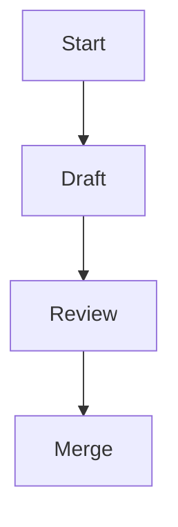

# Documentation style guide

This guide outlines conventions for authoring documentation for software
created by df12 Productions. Apply these rules to keep documentation clear,
consistent, and easy to maintain across projects.

## Spelling

- Use British English based on the
  [Oxford English Dictionary](https://public.oed.com/) locale `en-GB-oxendict`,
  which   denotes English for the Great Britain market in the Oxford style:
  - suffix -ize in words like _realize_ and _organization_ instead of
     -ise endings,
  - suffix ‑lyse in words not traced to the Greek ‑izo, ‑izein suffixes,
     such as _analyse_, _paralyse_ and _catalyse_,
  - suffix -our in words such as _colour_, _behaviour_ and _neighbour_,
  - suffix -re in words such as _calibre_, _centre_ and _fibre_,
  - double "l" in words such as _cancelled_, _counsellor_ and _cruellest_,
  - maintain the "e" in words such as _likeable_, _liveable_ and _rateable_,
  - suffix -ogue in words such as _analogue_ and _catalogue_,
  - and so forth.
- The word **"outwith"** is acceptable.
- Keep United States (US) spelling when used in an API, for example, `color`.
- The project uses the filename `LICENSE` for community consistency.

## Punctuation and grammar

- Use the Oxford comma: "ships, planes, and hovercraft" where it aids
  comprehension.
- Company names are treated as collective nouns: "df12 Productions are
  releasing an update".
- Avoid first and second person personal pronouns outside the `README.md`
  file.

## Headings

- Write headings in sentence case.
- Use Markdown headings (`#`, `##`, `###`, and so on) in order without skipping
  levels.

## Markdown rules

- Follow [markdownlint](https://github.com/DavidAnson/markdownlint)
  recommendations[^1].
- Provide code blocks and lists using standard Markdown syntax.
- Always provide a language identifier for fenced code blocks; use `plaintext`
  for non-code text.
- Use `-` as the first level bullet and renumber lists when items change.
- Prefer inline links using `[text](url)` or angle brackets around the URL.
- Ensure blank lines before and after bulleted lists and fenced blocks.
- Ensure tables have a delimiter line below the header row.

## Expanding acronyms

- Expand any uncommon acronym on first use, for example, Continuous Integration
  (CI).

## Formatting

- Wrap paragraphs at 80 columns.
- Wrap code at 120 columns.
- Do not wrap tables.
- Use GitHub-flavoured numeric footnotes referenced as `[^1]`.
- Footnotes must be numbered in order of appearance in the document.
- Caption every table, and caption every diagram.

## Standard document types

Repositories that adopt this documentation style should keep a small set of
high-value documents with clearly separated audiences and responsibilities.
These document types are complementary: the contents file helps readers find
material, the user's guide explains how to use the project, the developer's
guide explains how to work on the project, the design document explains why the
system is shaped the way it is, and the repository layout document explains
where important things live. For discoverability, use canonical filenames
unless a stronger repository-specific constraint applies: `docs/contents.md`,
`docs/users-guide.md`, `docs/developers-guide.md`, `docs/repository-layout.md`,
and a primary design document with an explicit product or topic name such as
`docs/theoremc-design.md` or `docs/query-planner-design.md`.

### Contents file

Use a dedicated contents file, typically `docs/contents.md`, as the index for
the documentation set.

- Make the document title explicit, for example `# Documentation contents`.
- Begin with the contents file linking to itself so readers can confirm they
  are at the index.
- List each document exactly once with an inline link and a short descriptive
  phrase explaining why someone would open it.
- Group related material together, such as decision records, reference
  documents, guides, and plan directories.
- Keep the descriptions audience-focused. Explain the purpose of the document,
  not merely its filename.
- Prefer stable ordering so repeated readers can scan predictably. Grouping by
  topic is usually better than strict alphabetic ordering.
- When listing a directory, add one nested level only where it materially
  improves navigation, for example to enumerate execution plans beneath an
  `execplans/` entry.
- Update the contents file whenever a document is added, renamed, or removed.

### User's guide

Use the user's guide, canonically `docs/users-guide.md`, for readers who need
to apply the project rather than modify its internals. In a library, this means
consumers of the application programming interface (API). In an application,
this means operators, end users, or integrators.

- Open with one short paragraph that states the audience and scope.
- Organize the guide around user-facing tasks, concepts, and guarantees rather
  than internal module boundaries.
- Introduce the primary workflow early, with a minimal working example that a
  reader can adapt immediately.
- Put public-facing reference material here when users need it to succeed, for
  example CLI usage, configuration keys, file-format rules, or API surface
  summaries.
- Present rules, constraints, defaults, and error behaviour near the feature
  they affect, rather than scattering them across the document.
- Use tables where they clarify field sets, command options, or compatibility
  matrices.
- Include concrete examples in code or data form when describing formats,
  schemas, or command usage.
- Higher-level user workflows belong here, for example "load a document",
  "configure the service", or "interpret diagnostics".
- Link to design documents or maintainer references when deeper rationale would
  otherwise overload the guide.
- Exclude maintainer-only concerns such as internal layering debates, future
  refactor plans, or enforcement tooling unless they directly affect users.

### Developer's guide

Use the developer's guide, canonically `docs/developers-guide.md`, for
maintainers and contributors. Treat this as the operating manual for working on
the existing system, not as the place for the project's primary design document.

- Open with one short paragraph that states the audience and the operational
  scope of the guide.
- Link early to the design document, accepted decision records, and other
  normative references that explain architecture or rationale in depth.
- Put maintainer-facing implementation guidance here, for example build, test,
  lint, release, debugging, extension, and contribution workflows.
- Use numbered sections for long-form technical documents to improve
  cross-referencing in reviews and follow-up discussions.
- Separate normative rules from informative explanation. Mark source-of-truth
  sections clearly.
- Include compact interface maps or workflow diagrams where they materially
  improve implementation guidance.
- Keep subsystem descriptions focused on current responsibilities,
  integration points, and operational expectations. Put design rationale, major
  trade-offs, and proposed architecture in design documents instead.
- Keep the document synchronized with decision records, roadmap items, and the
  codebase. A stale developer's guide is worse than a shorter one.

### Design document

Use a dedicated design document, conventionally named
`docs/<product-or-topic>-design.md`, when you need to explain the architecture,
constraints, rationale, and intended evolution of a system or subsystem. This
document is the right home for design intent; do not bury that material in the
user's guide or developer's guide.

- Start with a concise front matter section that states status, scope, primary
  audience, and the decision records or other documents that take precedence.
- Open the main body with the problem statement, product thesis, or design goal
  before describing the solution. Readers should understand the problem the
  design is solving before they inspect the structure.
- State the non-negotiable constraints explicitly. These are the rules later
  sections assume rather than re-justify.
- Separate normative definitions from informative explanation. If another
  document is the source of truth for a schema, protocol, or naming rule, say
  so plainly and link to it.
- Describe the high-level architecture before diving into file-level or
  module-level details. A reader should understand the major subsystems,
  boundaries, and data flow early.
- Use numbered sections for substantial designs so review comments, follow-up
  changes, and decision records can cite stable anchors.
- Include diagrams, tables, or pipeline sketches when they materially improve
  comprehension, especially for flows, layered boundaries, or generated
  artefacts.
- Record risks, trade-offs, rejected alternatives, and future extension points.
  A design document should explain not only what the system looks like, but why
  it takes that shape.
- Keep examples concrete and representative. Prefer one realistic example that
  exercises the important structure over several toy fragments.
- Keep the design document synchronized with accepted decision records and the
  implemented system. If the code or the governing decision changes, update the
  design or mark the divergence explicitly.

### Repository layout document

Use a repository layout document, canonically `docs/repository-layout.md`, to
explain the shape of the tree and the responsibilities of its major paths. This
may be a standalone document or a clearly labelled section within the
developer's guide, provided readers can find it easily from the contents file.

- Document the top-level directories and any critical subdirectories that a new
  contributor must understand quickly.
- Explain the purpose, ownership boundary, and notable conventions of each
  path, not just its name.
- Prefer a compact tree, table, or both. Use the tree for orientation and the
  prose or table for semantics.
- Distinguish between authoritative structure and illustrative sketches. If the
  tree is incomplete or simplified, say so explicitly.
- Highlight where source code, tests, generated artefacts, plans, and
  long-lived reference documents belong.
- Call out any directories with unusual constraints, such as generated output,
  fixtures, snapshots, or capability-restricted paths.
- Update the layout document when the repository structure changes enough that
  a contributor could otherwise follow outdated guidance.

## Example snippet

```rust,no_run
/// A simple function demonstrating documentation style.
fn add(a: i32, b: i32) -> i32 {
    a + b
}
```

## API doc comments (Rust)

Use doc comments to document public APIs. Keep them consistent with the
contents of the manual.

- Begin each block with `///`.
- Keep the summary line short, followed by further detail.
- Explicitly document all parameters with `# Parameters`, describing each
  argument.
- Document the return value with `# Returns`.
- Document any panics or errors with `# Panics` or `# Errors` as appropriate.
- Place examples under `# Examples` and mark the code block with `no_run`, so
  they do not execute during documentation tests.
- Put function attributes after the doc comment.

```rust,no_run
/// Returns the sum of `a` and `b`.
///
/// # Parameters
/// - `a`: The first integer to add.
/// - `b`: The second integer to add.
///
/// # Returns
/// The sum of `a` and `b`.
///
/// # Examples
///
/// ```rust,no_run
/// assert_eq!(add(2, 3), 5);
/// ```
#[inline]
pub fn add(a: i32, b: i32) -> i32 {
    a + b
}
```

## Diagrams and images

Where it adds clarity, include [Mermaid](https://mermaid.js.org/) diagrams.
When embedding figures, use `` and provide brief alt
text describing the content. Add a short description before each Mermaid
diagram, so screen readers can understand it.

For screen readers: The following flowchart outlines the documentation workflow.



_Figure 1: Documentation workflow from draft through merge review._

## Roadmap task writing guidelines

When documenting development roadmap items, write them to be achievable,
measurable, and structured. This ensures the roadmap functions as a practical
planning tool rather than a vague wishlist. Do not commit to timeframes in the
roadmap. Development effort should be roughly consistent from task to task.

### Principles for roadmap tasks

- Define outcomes, not intentions: Phrase tasks in terms of the capability
  delivered (e.g. “Implement role-based access control for API endpoints”), not
  aspirations like “Improve security”.
- Quantify completion criteria: Attach measurable finish lines (e.g. “90%
  test coverage for new modules”, “response times under 200ms”, “all endpoints
  migrated”).
- Break into atomic increments: Ensure tasks can be completed in weeks, not
  quarters. Large goals should be decomposed into clear, deliverable units.
- Tie to dependencies and sequencing: Document prerequisites, so tasks can be
  scheduled realistically (e.g. “Introduce central logging service” before “Add
  error dashboards”).
- Bound scope explicitly: Note both in-scope and out-of-scope elements (e.g.
  “Build analytics dashboard (excluding churn prediction)”).

### Hierarchy of scope

Roadmaps should be expressed in three layers of scope to maintain clarity and
navigability:

- Phases (strategic milestones) – Broad outcome-driven stages that represent
  significant capability shifts. Why the work matters.
- Steps (epics / workstreams) – Mid-sized clusters of related tasks grouped
  under a phase. What will be built.
- Tasks (execution units) – Small, measurable pieces of work with clear
  acceptance criteria. How it gets done.

______________________________________________________________________

[^1]: A linter that enforces consistent Markdown formatting.
