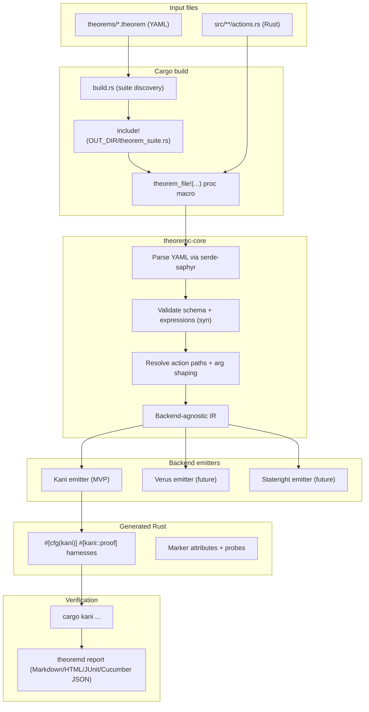
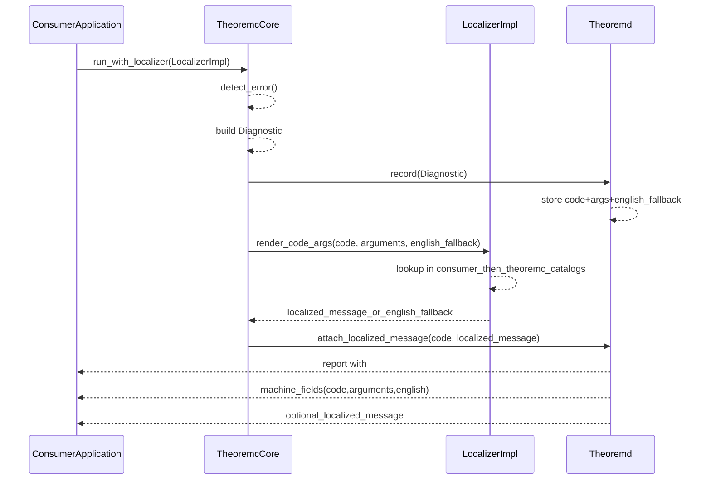
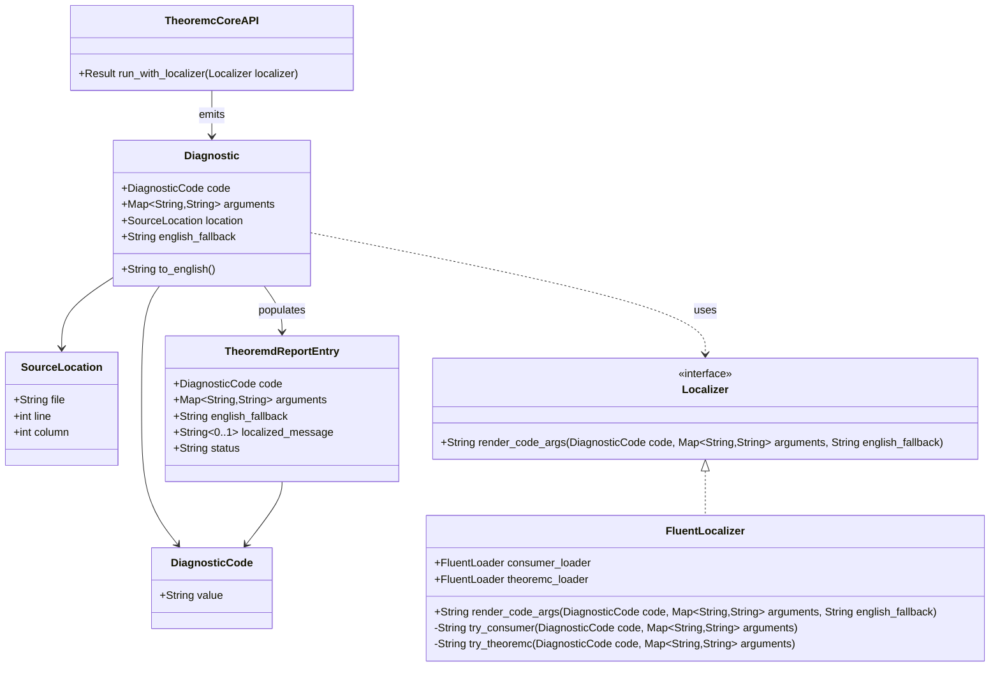
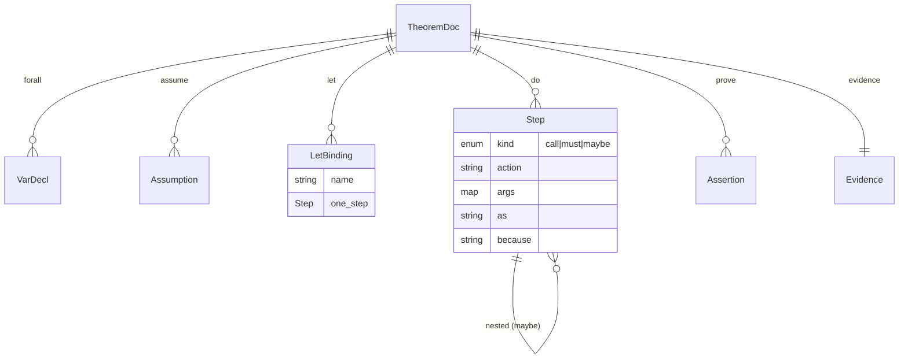

# Theoremc design specification

Status: draft (design settled for `.theorem` syntax + Kani MVP). Scope: Rust
workspace toolchain, compile-time correlation, and no inline Rust blocks in
`.theorem`. Primary audience: Rust engineers who want behaviour-driven
development (BDD)-level legibility for formal checks. Decision records:
[Architecture Decision Record (ADR) 001](adr-001-theorem-symbol-stability-and-non-vacuity-policy.md)
and [Architecture Decision Record (ADR) 002](adr-002-library-first-internationalization-and-localization-with-fluent.md).

This specification incorporates several useful structural elements (repo layout
sketch, risk framing, and some diagrams) from the attached Blitzy exploration,
but it treats the most recent design conversation as the source of truth for
the semantics and the “no inline Rust blocks” rule.

______________________________________________________________________

## 0. Normative references (single source of truth)

This document provides architecture-level intent and implementation shape. To
reduce drift risk, normative definitions are centralized:

- `docs/theorem-file-specification.md` is normative for theorem schema, step
  semantics, argument shaping, and evidence fields.
- `docs/name-mangling-rules.md` is normative for action and harness mangling,
  collision checks, and external theorem ID rules.
- `docs/adr-001-theorem-symbol-stability-and-non-vacuity-policy.md` records
  accepted rationale and trade-offs.
- `docs/adr-002-library-first-internationalization-and-localization-with-fluent.md`
  is normative for localization architecture, diagnostic rendering boundaries,
  and Fluent backend policy.

If wording differs between documents, the normative references above take
precedence.

______________________________________________________________________

## 1. Problem statement and product thesis

Modern agentic tooling and stronger static tooling (types, lints, docs) have
shown a pattern: practices that are too high-friction for teams become widely
adopted when tools absorb the cognitive and workflow cost.

Formal verification in Rust (Kani now; Verus/Stateright later) has historically
failed *adoption* not because it is useless, but because it creates artefacts
that are hard to read, hard to review, and hard to keep in sync with the code.

`theoremc` aims to turn proofs into first-class engineering artefacts with
behaviour-driven development (BDD)-like social ergonomics:

- a theorem is a human-readable claim,
- with explicit assumptions and boundedness,
- tied to typed Rust “actions” (step definitions),
- compiled into verification harnesses on every build,
- and reported in a form engineers can understand and scrutinize.

______________________________________________________________________

## 2. Non-negotiable constraints

1. **`.theorem` files are declarative and approachable.**
   They contain narrative text, variable declarations, assumptions, calls to
   named actions, and assertions-with-reasons.

2. **No inline Rust blocks inside `.theorem`.**
   Any non-trivial logic must live in `.rs` action code so it is linted,
   typechecked, refactorable, and reviewable.

3. **Per-build connectedness (rstest-bdd-style “always connected”).**
   `.theorem` ↔ actions ↔ generated harnesses must stay correlated through
   compilation (not a one-shot CLI scaffold).

4. **YAML parsing uses `serde-saphyr`.**
   `serde-saphyr` is a strongly typed YAML deserializer built on a pure-Rust
   YAML parser (“saphyr”), designed to be panic-free on malformed input and
   avoid unsafe code in the library layer.[^1]

______________________________________________________________________

## 3. High-level architecture

`theoremc` is a Cargo workspace composed of:

- a core library (`theoremc-core`) containing the schema, parsing, validation,
  resolution, diagnostic modelling, localization contracts, and
  backend-agnostic IR,
- a proc-macro crate (`theoremc-macros`) that embeds theorem compilation into
  normal Rust builds,
- backend emitter crates (MVP: Kani),
- a reporter CLI (`theoremd`) to run verification and produce human/CI reports,
- optional enforcement lints (`theoremc-dylint`) to discourage bypassing.

The “compile-time theorem loader” pattern uses proc-macro expansion each build
to generate harness code. Kani harnesses are functions annotated with
`#[kani::proof]` (and optionally `#[kani::unwind(n)]`).[^2]

### 3.1 Pipeline diagram



(Adapted from the attached exploration’s architecture sketch, updated to match
the “no inline Rust blocks” rule and to use `serde-saphyr`.)

______________________________________________________________________

## 4. The `.theorem` file format

### 4.1 Files and documents

- File extension: `.theorem` (UTF-8 text)
- A single `.theorem` file may contain **one or more YAML documents** separated
  by `---`. This is optional but useful for grouping related theorems.
  `serde-saphyr` explicitly supports deserializing multiple YAML documents from
  a string/slice.[^3]
- Each YAML document represents one theorem and must include `Theorem:`.

### 4.2 Settled syntax (source-of-truth)

This is the settled shape (the “hierarchical navigable small world (HNSW)/Kani
harnesses, no inline Rust blocks” form). It’s YAML-first, but supports typed
action calls and the `assert/because` pairing:

```yaml
Theorem: BidirectionalLinksCommitPath3Nodes
About:
  Commit-path reconciliation (including deferred scrubs) produces a bidirectional HNSW graph in a bounded 3-node configuration.
Tags: [hnsw, invariant, commit-path, kani]

Given:
  - max_connections = 1 so level-1 eviction can occur
  - Nodes: 0, 1, 2 all at level 1
  - Seed node 0’s level-1 neighbour list to capacity with node 2

Let:
  params:
    must:
      action: hnsw.params
      args: { max_connections: 1, max_level: 2 }
  max_connections:
    call:
      action: hnsw.max_connections
      args: { params: { ref: params } }
  graph:
    call:
      action: hnsw.graph_with_capacity
      args: { params: { ref: params }, capacity: 3 }

Do:
  - must:
      action: hnsw.insert_first
      args: { graph: { ref: graph }, node: 0, level: 1, sequence: 0 }

  - must:
      action: hnsw.attach_node
      args: { graph: { ref: graph }, node: 1, level: 1, sequence: 1 }

  - must:
      action: hnsw.attach_node
      args: { graph: { ref: graph }, node: 2, level: 1, sequence: 2 }

  - call:
      action: hnsw.add_bidirectional_edge
      args: { graph: { ref: graph }, origin: 0, target: 2, level: 1 }

  - must:
      action: hnsw.commit_apply
      args:
        graph: { ref: graph }
        max_connections: { ref: max_connections }
        new_node: { id: 1, level: 1 }
        updates:
          - node: 1
            level: 1
            candidates: [0]
            kept: [0]

Witness:
  - cover: "hnsw.edge_present(&graph, 0, 1, 1)"
    because: "the harness reaches the reconciliation path under symbolic input"

Prove:
  - assert: "hnsw.is_bidirectional(&graph)"
    because: "bidirectional invariant holds after commit-path reconciliation"

  - assert: "!hnsw.edge_present(&graph, 2, 0, 1)"
    because: "deferred scrub removes the orphaned forward edge"

Evidence:
  kani:
    unwind: 10
    expect: SUCCESS
```

Two important observations:

- The `.theorem` file can pass **structured YAML values** (like
  `new_node: { id: 1, level: 1 }`) into actions; the generator will synthesize
  Rust struct literals based on the action’s parameter types (details below).
  This keeps theorem files declarative while still allowing rich scenarios.
- Assertions (`assert:`) and assumptions (`Assume.expr`) are allowed to be
  single Rust expressions (as strings) and are validated syntactically using
  `syn` before codegen. No multi-line blocks.

### 4.3 Top-level sections and meaning

Each theorem document supports the following sections:

- `Theorem: <String>`
  Required. Must be unique within the crate (after name mangling for generated
  harnesses).

- `About: <String | YAML block string>`
  Required. Human-intent summary (mandatory to force legibility).

- `Tags: [..]`
  Optional. Used for reporting, CI filtering, ownership, and grouping.

- `Given: [<String>...]`
  Optional but recommended. Narrative context. Does not affect semantics.

- `Forall:`
  Optional. Symbolic variables to quantify. In Kani, these become `kani::any()`
  values.[^2] In future backends, these map to universal quantification (Verus)
  or state variable domains (Stateright).

- `Assume:`
  Optional list of constraints. Each item contains:

  - `expr: "<Rust boolean expr>"`
  - `because: "<human explanation>"` (required)

- `Let:`
  Optional. Named bindings evaluated once, in YAML order, before `Do:`. Think
  “fixtures / derived constants”.

- `Do:`
  Required (MVP; may be empty for pure property theorems, but practical suites
  should include at least one action or witness). This is a sequence of steps.

- `Prove:`
  Required. Assertions-with-reasons.

- `Witness:`
  Required unless `Evidence.kani.allow_vacuous: true`. Each witness is a
  cover-expression with a human explanation.

- `Evidence:`
  Required. Backend configuration (MVP: Kani). Stores bounds/limits and
  expected outcomes.

### 4.4 Step forms in `Let` and `Do`

A *step* is one of:

1. `call` — invoke an action
2. `must` — invoke an action and prove it cannot fail
3. `maybe` — symbolic branch containing nested steps

#### 4.4.1 `call`

```yaml
- call:
    action: hnsw.add_bidirectional_edge
    args: { graph: { ref: graph }, origin: 0, target: 2, level: 1 }
    as: some_binding   # optional in Do; implicit in Let
```

Semantics (Kani MVP):

- Evaluate arguments.
- Invoke the resolved action function.
- If `as:` is present, bind the return value to that name.

Validation rule (MVP): if an action returns `Result` or `Option`, a `call` step
must bind it with `as:` (otherwise potential failure is silently discarded).
Prefer `must` when the intent is “this cannot fail”.

#### 4.4.2 `must`

```yaml
- must:
    action: hnsw.attach_node
    args: { graph: { ref: graph }, node: 2, level: 1, sequence: 2 }
```

Semantics:

- It is a *proof obligation* that the action does not fail under the current
  assumptions.

Concretely:

- If the action returns `Result<T, E>`, then `must` expands to:

  - evaluate call,
  - `assert!(result.is_ok(), "...")`,
  - unwrap,
  - bind `T` if needed.
- If the action returns `Option<T>`, similarly:

  - `assert!(opt.is_some(), "...")`, then unwrap.
- If the action is infallible (returns `T` or `()`), `must` is allowed but adds
  no new obligation (it acts as documentary intent).

This aligns with Kani’s model: proof harnesses may use Rust assertions as the
properties to be verified, and failing assertions produce counterexamples.[^2]

#### 4.4.3 `maybe`

```yaml
- maybe:
    because: "optional baseline edge"
    do:
      - call:
          action: hnsw.add_bidirectional_edge
          args: { graph: { ref: graph }, origin: 0, target: 1, level: 0 }
```

Semantics:

- `maybe` introduces a fresh, unconstrained boolean choice.
- For Kani, this compiles to `let b: bool = kani::any(); if b { ... }`, and
  Kani explores both branches (subject to unwind bounds).[^2]

Important: `maybe` is not “random”; it is *symbolic branching*.

### 4.5 Assertion form (`Prove`)

Each proof obligation is:

```yaml
- assert: "<Rust boolean expr>"
  because: "<human explanation>"
```

Rules:

- `assert` must be a single Rust expression that typechecks to `bool`.
- `because` is required.
- The generator emits `assert!(<expr>, "<because>")`, and uses the message to
  make Kani output human-readable. Kani reports reachability/vacuity and check
  status for asserts; readable assertion descriptions materially improve
  review/debug experience.[^4]

### 4.6 Evidence section (MVP: Kani)

```yaml
Evidence:
  kani:
    unwind: 10
    expect: SUCCESS
    allow_vacuous: false
```

- `unwind`: required. Mapped to `#[kani::unwind(n)]`.[^2]
- `expect`: required. Used by reporting/CI: expected harness result (e.g.,
  `SUCCESS`, `FAILURE`, `UNREACHABLE`, `UNDETERMINED`). Kani documents statuses
  including `UNREACHABLE` as “property holds vacuously.”[^4]
- `allow_vacuous`: optional boolean, default `false`.
- `vacuity_because`: required when `allow_vacuous: true`.

In MVP, `UNREACHABLE` and `UNDETERMINED` are treated as failures by default
unless explicitly expected, because “green but vacuous/unknown” is a
reliability hazard.[^4]

### 4.7 Theorem schema internationalization scope

ADR 002 explicitly keeps theorem schema keywords language-stable in this
release line. Canonical field names in `.theorem` files remain:
`Theorem`, `Given`, `Let`, `Do`, `Prove`, and `Evidence`.

This means theoremc localizes diagnostics and reports, not theorem syntax.
Keyword internationalization (for example, parser support for localized schema
keys) is deferred to a future ADR after demand and migration impact are
validated.

______________________________________________________________________

## 5. Rust actions (“step definitions” for proofs)

### 5.1 Design intent

Actions are where *behaviour* lives. They are ordinary Rust functions in `.rs`
files. This ensures:

- Clippy/rustfmt applies,
- the Rust typechecker enforces everything,
- IDE refactors work,
- reviews happen in real code, not embedded DSL snippets.

`.theorem` files remain a readable storyboard of the proof.

### 5.2 Action naming and resolution

The compiler must resolve `action: hnsw.attach_node` into a *real function
path* at compile time.

Key constraint: Rust procedural macros cannot query link-time registries (like
`inventory`) during macro expansion. Therefore, compile-time resolution must be
deterministic and compile-time-checkable *without scanning the compiled
program*.

**Resolution rule (MVP):**

- Each crate that uses theoremc defines a module `crate::theorem_actions` (name
  configurable later).
- The action name `foo.bar` maps to a function identifier in that module by a
  fixed, injective mangling rule:

```plaintext
action "hnsw.attach_node"
  -> function path
  "crate::theorem_actions::hnsw__attach_unode__h3f6b2a80c9d1"
```

The mangling algorithm follows `docs/name-mangling-rules.md`:

- Escape each segment by replacing `_` with `_u`.
- Join escaped segments with `__`.
- Append `__h{hash12(canonical_action_name)}`.

Build-time checks must fail on either duplicate canonical action names or
duplicate mangled identifiers.

- Authors may implement the function directly there or re-export it:

```rust
// src/theorem_actions.rs or src/theorem_actions/mod.rs
pub use crate::hnsw::actions::attach_node as hnsw__attach_unode__h3f6b2a80c9d1;
```

This keeps `.theorem` friendly while giving the compiler a direct, typed
binding point.

### 5.3 Optional attribute macro (documentation + reporting)

An additional attribute macro remains available:

```rust
#[theorem_action("hnsw.attach_node")]
pub fn attach_node(/*...*/) -> Result<(), AttachError> { /*...*/ }
```

Purposes:

- produce compile-time checks that the string name matches the mangled export,
- emit metadata for reporting (theoremd),
- enable future tooling (docs, coverage, cross-ref navigation).

For metadata collection, `inventory` is appropriate: it provides typed
distributed plugin registration with no central list requirement.[^5] (This is
used for reporting and coverage, not for compile-time resolution.)

### 5.4 Action signature rules

To keep generation predictable and avoid implicit cloning/magic:

- Parameters must be simple patterns: identifiers only (`graph: &mut Graph`,
  not destructuring).
- Parameter identifiers must be unique; they become the keys used in `.theorem`
  `args: { ... }`.
- Return types may be:

  - `()`
  - `T`
  - `Result<T, E>`
  - `Option<T>`

Anything more exotic is allowed in Rust but may not be supported for `must`
semantics in MVP.

### 5.5 Argument shaping rules (how YAML becomes Rust)

The generator constructs a Rust expression for each argument based on:

- the YAML value,
- and the *expected parameter type* from the action signature.

Supported YAML value forms:

- scalars: int/bool/string
- lists: `[ ... ]`
- maps: `{ key: value, ... }`

#### 5.5.1 Explicit variable references and string literals

To avoid accidental semantics changes over time:

- Plain YAML strings are always string literals.
- Variable references must use the explicit `{ ref: <Identifier> }` wrapper.
- String literals may optionally use `{ literal: <String> }`.

Examples:

```yaml
args:
  graph_ref: { ref: graph }
  label: { literal: "graph" }
```

This avoids the case where adding a new binding silently changes the meaning of
an existing argument string.

#### 5.5.2 Struct literal synthesis

If an action parameter expects a struct type `T` and YAML provides a map:

```yaml
new_node: { id: 1, level: 1 }
```

the generator emits:

```rust
T { id: 1, level: 1 }
```

Field names come from YAML keys. The Rust compiler enforces that `T` actually
has those fields.

Similarly, lists become `vec![...]` recursively.

This allows theorems to pass rich configuration data to actions without
requiring inline Rust code blocks.

#### 5.5.3 Borrowing and mutability

The generator adapts argument passing based on parameter type:

- parameter `&mut T`  → pass `&mut var`
- parameter `&T`      → pass `&var`
- parameter `T`       → pass `var` (move)

If a variable is ever passed as `&mut`, the generator declares it
`let mut var = ...;`.

If a theorem uses a variable after it is moved into a by-value parameter, that
is a normal Rust move error and is treated as a theorem authoring error
(surfaced at compile time). Auto-cloning is not applied.

______________________________________________________________________

## 6. Parsing and validation

### 6.1 YAML parsing with `serde-saphyr`

`theoremc-core` uses `serde-saphyr` to deserialize theorem documents into
strongly typed Rust structs.

Motivation: `serde-saphyr` is designed to be panic-free on malformed input and
avoid unsafe code in the library layer, and it is built atop the `saphyr` YAML
parser ecosystem.[^1]

Implementation sketch (core library):

- `serde_saphyr::from_str::<TheoremDoc>(&yaml_text)` for single-doc files.[^3]
- For multi-doc `.theorem` files, use the crate’s multi-document APIs (or wrap
  its options API) and return `Vec<TheoremDoc>`.[^3]

### 6.2 Schema validation

Validation happens in three layers:

1. **Structural:** required fields exist (`Theorem`, `About`, `Prove`,
   `Evidence.kani.unwind` etc).
2. **Expression syntax:** `Assume.expr` and `Prove.assert` parse as `syn::Expr`
   (syntax only).
3. **Semantic:** step shapes make sense (`maybe` contains `do`, `call` on
   fallible action requires `as` or `must`, `because` required for
   assumptions/asserts).

### 6.3 Diagnostics

All diagnostics must be source-located and actionable.

`serde-saphyr` already focuses on good location information; its docs describe
error messages that include snippets and precise location information, even
across YAML anchors.[^3] These are wrapped into `miette` diagnostics so errors
in theorem files point to the exact line/column.

### 6.4 Implementation decisions (Step 1.1)

The following decisions were taken during the implementation of schema
deserialization (Step 1.1 of the roadmap):

- `deny_unknown_fields` cannot coexist with `#[serde(untagged)]` on the same
  enum container (`LetBinding`, `Step`). `deny_unknown_fields` is placed on
  inner structs (`ActionCall`, `MaybeBlock`) instead; the untagged enum's
  variant matching already rejects unknown shapes structurally.
- `serde-saphyr` does not provide a `Value` type. A project-specific
  `TheoremValue` enum is used (`Bool`, `Integer`, `Float`, `String`,
  `Sequence`, `Mapping`) with a handwritten `Deserialize` implementation. This
  enforces no-null at the type level and avoids an unnecessary `serde_json`
  dependency.
- `KaniExpectation` is modelled as a Rust enum with four variants (`Success`,
  `Failure`, `Unreachable`, `Undetermined`) and `#[serde(rename)]` attributes
  for the `UPPERCASE` string forms, catching invalid values at deserialization
  time.
- Schema types live in `src/schema/` (not `src/parser/`) because Step 1.1
  is purely deserialization. The eventual `parser/` module in the workspace
  layout will encompass the full parsing and validation pipeline.
- The `ActionCall.as` field uses Rust field name `as_binding` with
  `#[serde(rename = "as", default)]`.
- `src/lib.rs` is added alongside `src/main.rs` so schema types are testable
  as a library. Cargo supports this layout natively for a single package with
  both `lib` and `bin` targets.
- `rstest-bdd` v0.5.0 was evaluated but lacks documentation for concrete
  usage patterns. `rstest` parameterized tests with BDD-style naming
  conventions are used instead.

### 6.5 Localized diagnostics contract (ADR 002)

Theoremc adopts a library-first localization boundary for diagnostics:

- Diagnostics are represented first as stable machine-readable data:
  diagnostic code, structured arguments, and source location.
- Every diagnostic also carries an English fallback string as the required
  baseline human message.
- Localization is applied only at display/reporting boundaries via an injected
  localizer interface; localized strings are not the source of truth.

Locale negotiation and process-level localization state belong to the consumer
application. Theoremc does not read locale environment variables and does not
mutate global or thread-local localization state.

The default backend for human-facing localization is Fluent:

- theoremc ships embedded Fluent resources for `en-US`,
- consumers may layer their own resources over theoremc defaults,
- formatter failures or missing keys fall back deterministically (consumer
  message → theoremc default message → English fallback string).

This preserves composability for library consumers while keeping deterministic,
inspectable diagnostics for tooling and CI.

### 6.6 Localization rendering sequence

Figure 1. Diagnostic capture, localization rendering, and report projection
flow under the ADR 002 library-first localization model.



### 6.7 Diagnostic and localization class model

Figure 2. Class-level model for diagnostic payloads, localization contracts,
and report-entry population in theoremc and theoremd.



______________________________________________________________________

## 7. Build integration ("always connected")

### 7.1 `build.rs` suite discovery

To get “drop a file in `theorems/` and it participates”, the design uses a
build script:

- scan `theorems/` for `*.theorem`,
- emit `cargo::rerun-if-changed=<path>` for the directory and each file,
- generate `OUT_DIR/theorem_suite.rs` containing one `theorem_file!(...)`
  invocation per file,
- compile it via `include!()`.

Cargo documents that `cargo::rerun-if-changed=PATH` reruns the build script
when the file changes, and if the path is a directory Cargo scans it for
modifications.[^6]

Per-file rerun lines are also emitted for robustness across Cargo versions and
edge cases.

### 7.2 The `theorem_file!()` proc macro

For each `.theorem` file, the macro expands to:

- A private module named from the file stem (sanitized).

- A `const _: &str = include_str!(...)` inside that module. `include_str!`
  includes a file at compile time as `&'static str`.[^7] (This is “belt and
  braces”; build.rs already wires rebuilds, but `include_str!` also ensures the
  theorem content is a compile-time input.)

- One generated harness function per theorem document in the file:

  - `#[cfg(kani)]`
  - `#[kani::proof]`
  - `#[kani::unwind(n)]` (from `Evidence.kani.unwind`)[^2]

Kani explicitly notes that naively writing `#[kani::proof]` in code will make a
normal `cargo build` fail unless it is gated (because the `kani` crate is not
present in non-Kani builds).[^8] Therefore, theoremc-generated harnesses are
always behind `#[cfg(kani)]` (or an equivalent feature gate).

### 7.3 Binding probes

“Typecheck probes” are generated to make drift obvious:

- For each referenced action function, emit a
  `let _: fn(...) -> ... = crate::theorem_actions::...;`
- For referenced types, emit phantom usages.

This ensures that renames, signature drift, or missing re-exports fail
compilation immediately, not “later when running theoremd”.

______________________________________________________________________

## 8. Kani backend (MVP)

### 8.1 Harness generation strategy

For each theorem:

1. Create a parameterless proof harness function (the Kani unit of
   verification).[^2]
2. For `Forall` variables:

   - emit `let x: Ty = kani::any();` (symbolic input).[^2]
3. Emit all `Assume` expressions as `kani::assume(<expr>);`.
4. Emit `Let` bindings (in order).
5. Execute `Do` steps:

   - `call` → invoke action
   - `must` → invoke + assert success + unwrap
   - `maybe` → symbolic boolean guard around nested steps
6. Emit `Prove` assertions using `assert!(expr, because)`.

### 8.2 Must/maybe codegen rules (precise)

- `must` maps a fallible outcome into a proof obligation by asserting
  `Ok`/`Some` before unwrapping.
- `maybe` introduces a fresh boolean `kani::any::<bool>()` and branches; Kani
  explores both.[^9]

### 8.3 Vacuity and “unknown” results

Kani documents that `UNREACHABLE` means a check is unreachable and the property
holds vacuously, and it reports reachability for assertion macros.[^4]
Therefore:

- theoremd treats `UNREACHABLE` as failure unless explicitly expected,
- and requires nontriviality witnesses unless vacuity is explicitly justified.

### 8.4 Nontriviality witnesses (required by default)

To prevent “green but meaningless” harnesses:

- Theorem documents must include `Witness:` with at least one `cover` entry.
- `Witness` entries compile to `kani::cover!` markers.
- Vacuity may be accepted only when `Evidence.kani.allow_vacuous: true` and
  `Evidence.kani.vacuity_because` is present.

This is a direct response to the vacuity risk described above.[^4]

### 8.5 Concrete playback (debugging ergonomics)

Kani’s usage supports concrete playback generation (replaying counterexamples
as concrete tests), which turns a model-checker failure into a reproducible
unit test for humans.[^8] `theoremd` integrates this by re-running failed
harnesses with the relevant Kani flags and attaching the produced playback to
reports (MVP: `print`; later: `inplace` workflows).

______________________________________________________________________

## 9. Reporting (`theoremd`)

`theoremd` runs theorem suites and generates artefacts:

- Human-friendly report (Markdown/HTML).
- CI formats (JUnit XML, Cucumber JSON) to integrate with existing “test
  dashboards”.

Report content per theorem:

- stable theorem ID (`normalized_path#Theorem`)
- name, about, tags, backend
- assumptions (with “because”)
- steps (Do/Let) with pass/fail and any “must failed” counterexample context
- prove assertions (each labelled by its “because”)
- witness coverage results
- evidence config (unwind, expected status)
- diagnostic code and structured arguments (machine-readable)
- English fallback message text
- optional localized message text (when a localizer is provided)
- result status: success/failure/unreachable/undetermined
- concrete playback artefact (on failure)

Theoremd also supports ID migration aliases via
`theorems/theorem-id-aliases.yaml`:

- old canonical ID → new canonical ID
- acyclic alias graph required
- each deprecated ID resolves to exactly one canonical ID

Machine-facing artefacts remain deterministic regardless of locale:

- compile-time diagnostics from proc macros and code generation are always
  emitted in deterministic English,
- CI outputs (for example JUnit XML, Cucumber JSON, and future JSON reports)
  always include stable diagnostic codes and structured fields,
- localized human text is an optional projection, not a required field for
  machine consumers.

______________________________________________________________________

## 10. Enforcement (guardrails, not the primary binding mechanism)

Enforcement is used to discourage bypass, not to keep things in sync.

`theoremc-dylint` provides lints using Dylint, which runs Rust lints from
dynamic libraries.[^10]

MVP lints:

- forbid `kani::assume` outside theoremc-generated harness modules,
- forbid `#[kani::proof]` harnesses that don’t carry a theoremc marker
  attribute,
- optionally flag direct use of “trust-introducing” constructs in future
  backends (Verus TCB guard).

______________________________________________________________________

## 11. Repository layout (workspace)

The layout below follows the attached exploration’s successful separation of
concerns, but updates parsing to `serde-saphyr` and corrects the
action-resolution story to match the compile-time binding rules.

```plaintext
/
├── Cargo.toml
├── crates/
│   ├── theoremc-core/
│   │   └── src/
│   │       ├── parser/        # serde-saphyr schema + validation
│   │       ├── resolver/      # action path resolution + arg shaping
│   │       ├── ir/            # backend-agnostic IR
│   │       └── backends/      # backend-agnostic interfaces
│   ├── theoremc-macros/
│   │   └── src/               # theorem_file! proc macro, #[theorem_action]
│   ├── theoremc-backends/
│   │   └── src/
│   │       └── kani/          # MVP emitter + runner helpers (optional)
│   ├── theoremd/
│   │   └── src/               # runner + report formats
│   └── theoremc-dylint/
│       └── src/               # optional enforcement lints
├── examples/
│   ├── account/
│   └── hnsw/
└── docs/
    ├── reference/theorem-schema.md
    └── guides/writing-theorems.md
```

______________________________________________________________________

## 12. Risks and mitigations

This borrows the risk framing from the attached exploration but applies it to
the settled syntax and the “no inline Rust blocks” rule.

### 12.1 Vacuous success and over-constraint

Risk: a theorem “passes” because the harness never reaches the assertion
(`UNREACHABLE`) or constraints remove all interesting executions.

Mitigation:

- treat `UNREACHABLE` as failure by default, surfaced explicitly in reports,
  per Kani’s definition.[^4]
- support nontriviality witnesses (`cover`/`Witness`).
- encourage `maybe` branching and “sometimes” witnesses when Stateright is
  added later.

### 12.2 State-space explosion

Risk: naïve `maybe` usage on nested loops turns a proof into “CBMC melts your
laptop”.

Mitigation:

- require explicit `Evidence.kani.unwind` so bounds are visible.[^2]
- warn in docs when a theorem contains many `maybe` steps or nested heuristics.
- recommend action design that keeps search space tight (fixture builders,
  bounded domains).

### 12.3 Drift and bypass

Risk: engineers bypass theoremc and write raw Kani harnesses, fragmenting the
assurance story.

Mitigation:

- make theorem suites pleasant enough that bypassing is socially awkward,
- enforce with Dylint lints where desired.[^10]

### 12.4 YAML parser safety / weird YAML features

Risk: YAML anchors/aliases/merge keys create confusing specs or parser issues.

Mitigation:

- use `serde-saphyr`, which is built on the saphyr parser ecosystem and focuses
  on robust, panic-free deserialization without unsafe code in the library
  layer.[^1]
- define a strict schema; reject unknown keys; keep args shaping deterministic.
- optionally disable/limit YAML features via `serde-saphyr` options if the
  crate exposes them (implementation detail).

______________________________________________________________________

## 13. Future backends (brief)

The schema is intentionally constrained in its narrative and step structure.

- **Verus**: `Forall` maps naturally to quantification, `Assume` to
  preconditions, `Prove` to ensures/lemmas. `maybe` means “for all booleans”
  branching. The biggest design work is the proof-hint workflow and the TCB
  budget reporting.

- **Stateright**: `Do` steps become model actions; `Prove` maps to `always`
  properties; add an explicit `Sometimes:` or `Witness:` section for
  reachability checks.

- **Alloy**: `alloy2theorem` generates draft theorem docs from discovered
  invariants, but `.theorem` remains the source of truth.

______________________________________________________________________

## Appendix A: Data model sketch



______________________________________________________________________

## Appendix B: Why `serde-saphyr` (explicit)

`serde-saphyr` is explicitly positioned as a strongly typed YAML deserializer
built on a pure-Rust YAML parser, with goals including being panic-free on
malformed input and avoiding unsafe code in the library layer.[^1] That aligns
with theoremc’s threat model: theorems are build inputs and will be fed to CI;
they must not be able to crash the compiler toolchain via malicious YAML.

______________________________________________________________________

To push this specification one notch further into “ready for implementation”,
the next most valuable addition would be a complete, concrete YAML schema
reference (field-by-field) and the precise mangling rules for action names and
harness names. The remaining work is mostly engineering.

[^1]: <https://docs.rs/crate/serde-saphyr/latest?utm_source=chatgpt.com>
      "serde-saphyr 0.0.7"
[^2]: <https://model-checking.github.io/kani/reference/attributes.html?utm_source=chatgpt.com>
       "Attributes - The Kani Rust Verifier"
[^3]: <https://docs.rs/serde-saphyr?utm_source=chatgpt.com> "serde_saphyr -
      Rust"
[^4]: <https://model-checking.github.io/kani/verification-results.html?utm_source=chatgpt.com>
       "Verification results - The Kani Rust Verifier"
[^5]: <https://docs.rs/inventory> "<https://docs.rs/inventory>"
[^6]: <https://doc.rust-lang.org/cargo/reference/build-scripts.html>
      "<https://doc.rust-lang.org/cargo/reference/build-scripts.html>"
[^7]: <https://doc.rust-lang.org/std/macro.include_str.html?utm_source=chatgpt.com>
       "include_str in std"
[^8]: <https://model-checking.github.io/kani/usage.html?utm_source=chatgpt.com>
      "Using Kani - The Kani Rust Verifier"
[^9]: <https://arxiv.org/html/2510.01072v1?utm_source=chatgpt.com> "Lessons
      Learned So Far From Verifying the Rust Standard …"
[^10]: <https://github.com/trailofbits/dylint>
       "<https://github.com/trailofbits/dylint>"
